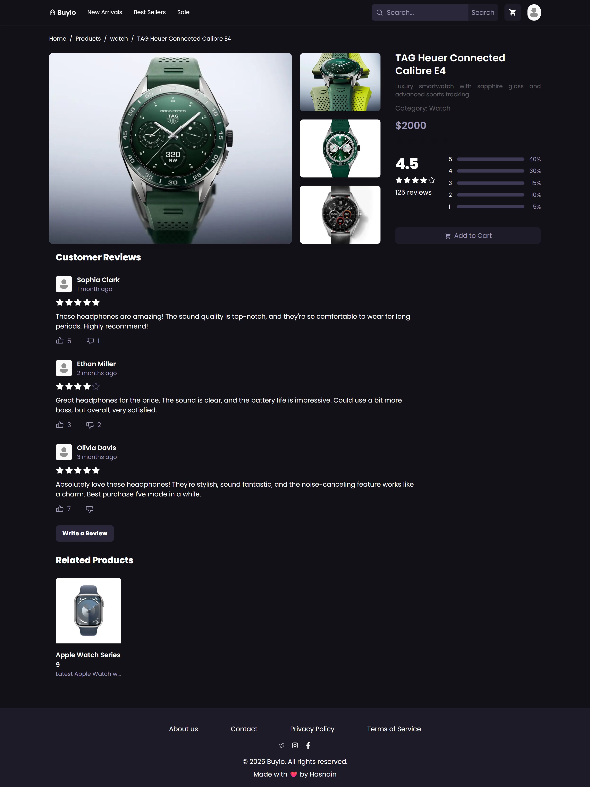
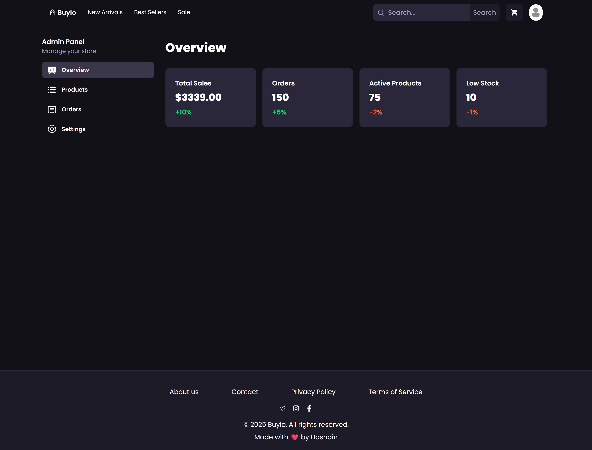

# 🛒 E-Commerce App (React + Firebase)

A full-featured **E-Commerce application** built with React, Redux, Firebase, and modern web technologies.  
The app includes a **public storefront**, **user features** (cart, favorites, orders, profile), and an **admin dashboard** for managing products and orders.  

## 🌐 Live Demo  
🔗 [Click here to view the live app](https://ha-store.netlify.app)  

---

## 🚀 Features

### 🌍 Public Routes
- **Header & Footer Layout**: Consistent across all pages  
- **Home Page**:  
  - Hero Banner  
  - Featured Products section  
  - Newsletter subscription section  
- **Product Listing Page**  
- **Product Detail Page**  

---

### 👤 User Features (Private Routes)
- **Profile Page**  
  - Tabs with animations:  
    - 🛒 Cart  
    - ❤️ Favorites  
    - 📦 Order History  
  - Shows user name, email, and joined date  
- **Cart Tab**  
  - Table showing cart items, total amount, etc.  
  - **Proceed to Payment** → Payment Form Page  
  - Saved address popup with "Proceed" or "Create New Address" option  
  - Cart auto-clears after successful order  
- **Order History**  
  - List of all past orders  
  - Cancel orders + option to delete cancelled orders  
- **Favorites**  
  - Shows all favorited products  

---

### 🛠️ Admin Dashboard (Private Routes)
- **Overview Page** → Displays total sales, summary metrics  
- **Products Management**  
  - Add, Update, Delete products  
- **Orders Management**  
  - View all orders  
  - Update order status with pre-defined options  

---

## 🧑‍💻 Tech Stack
- **Frontend**: React, Redux, React Router  
- **Backend & Auth**: Firebase (Authentication, Firestore, Storage)  
- **Styling**: Tailwind CSS / modern responsive design  
- **State Management**: Redux Toolkit  
- **Payment Flow**: Custom form with saved address support  

---


## 🖥️ Installation & Setup

1. Clone the repo  
   ```bash
   git clone https://github.com/your-username/ecommerce-app.git
   cd ecommerce-app
2. Install dependencies
  ```bash
  npm install
```

3. Setup Firebase

- Create a Firebase project

- Enable Authentication, Firestore, Storage

- Add your config in Firebase/Firebase.js

```bash
npm run dev
```

--- 

## 📸 Screenshots

---
### Home Page Screen-Shot


---

### Product listing Page Screen-Shot



---

### Product Page Screen-Shot



---

🔮 Future Improvements

- Integration with real payment gateways (Stripe, PayPal, etc.)

- Product search & filtering

- Responsive product grid for better mobile experience

- Email notifications on order updates

👤 Author

- Hasnain Ali

- 📧 hasnain5f7@gmail.com

- 🌐 Portfolio

- 💼 [LinkedIn](https://www.linkedin.com/in/hasnainaliansari/)

